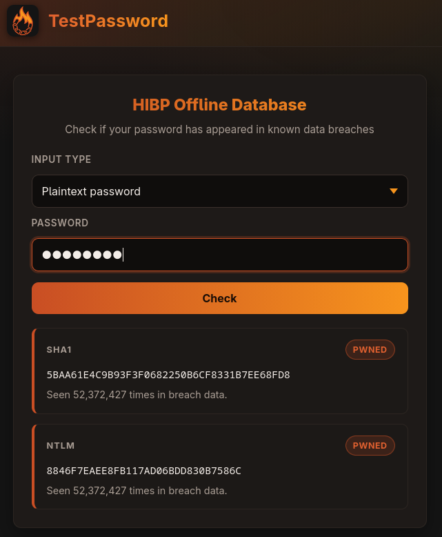

# TestPassword

<p align="center">
  
</p>

Check passwords against the Have I Been Pwned breach data, fully offline, from a
web UI or a [command-line client](src/client/README.md).

## 1. Pick a deployment

| Folder | Use it for |
| --- | --- |
| [`deploy/standalone`](deploy/standalone/) | One host, data on local disk. The simplest option. |
| [`deploy/standalone-s3`](deploy/standalone-s3/) | One host, data in a bundled S3 server. |
| [`deploy/split/data-host`](deploy/split/data-host/) + [`deploy/split/api-host`](deploy/split/api-host/) | Data on one host, web UI on another. |
| [`deploy/external-s3`](deploy/external-s3/) | One host, data in an S3 bucket you provide (AWS or compatible). |

## 2. Start it

```sh
cd deploy/<folder>
cp .env.example .env               # fill in what it asks for
docker compose up -d               # web UI on https://localhost
id=$(docker compose run -d ingest) # download the breach data; takes a few hours
docker logs -f "$id"               # watch progress (skip both on split/api-host)
```

The folder's README has the exact steps; the split deployment has one per host.
Lookups work while the data loads, but "not found" is only conclusive once it
finishes.

## 3. Open it to your network

By default the web UI only answers on this machine, with a self-signed
certificate. In the deployment folder:

1. Put your certificate's `fullchain.pem` and `privkey.pem` in `proxy/certs/`,
   readable by UID 65532.
2. Copy `proxy/tls.yaml.example` to `proxy/dynamic/tls.yaml`.
3. Set `PWNED_WEB_BIND` in `.env` to the address to listen on, then run
   `docker compose up -d` again.

## More

- [Operating it](docs/operations.md): data jobs, S3 storage, limits.
- [Building the images](docs/building.md): CI, proxies, mirrors, development.

## Licence

TestPassword is [MIT licensed](LICENSE). The `pwned-downloader` image bundles the
BSD-3-Clause [Pwned Passwords downloader](https://github.com/HaveIBeenPwned/PwnedPasswordsDownloader);
its notice ships in the image and is reproduced in
[`src/database/THIRD-PARTY-NOTICES`](src/database/THIRD-PARTY-NOTICES). The breach data is
downloaded from Have I Been Pwned at runtime and is not redistributed by this project.
TestPassword is not affiliated with or endorsed by Have I Been Pwned.
